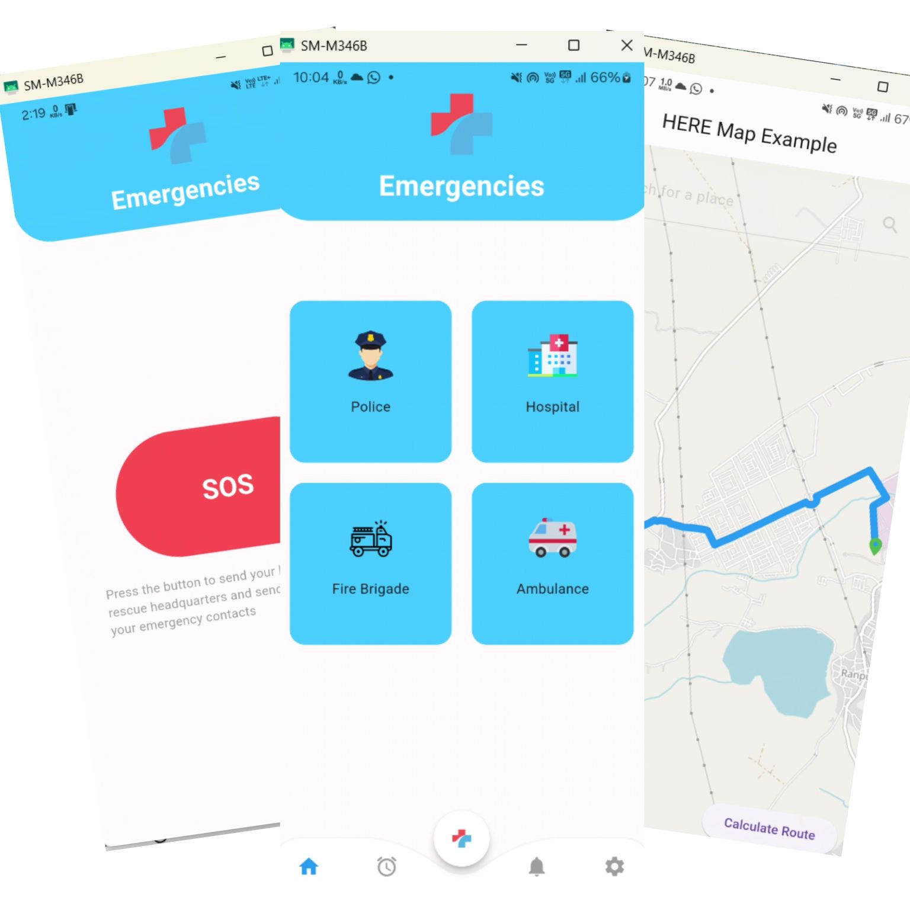

# One Tap Solution for Emergencies 🚀

## About the Project
Our team embarked on an exciting journey at the **HEREvolution Codefest-Hackathon at BITS Pilani**, where we developed an innovative emergency response app within **24 hours**. This application leverages **Flutter** for the frontend, **Firebase** for the backend, and **HERE APIs** for real-time tracking and mapping capabilities.
<p align="center">

</p>

### 🎯 Objective
To create a **"One tap solution for emergencies"** that alerts nearby individuals during an SOS emergency and provides live tracking to facilitate swift assistance. Unlike traditional alert systems, our app notifies not only SOS officials but also the **nearby community**, reducing response time and potentially saving lives.

## Key Features 🌟
- **Instant SOS Alerts**: Notifies nearby users and emergency responders.
- **Live Tracking**: Provides real-time location updates.
- **Community-Driven Response**: Encourages collective action for faster assistance.
- **HERE APIs Integration**: Ensures accurate mapping and navigation.
- **Seamless User Experience**: Built with **Flutter** for a smooth and responsive UI.

## Tech Stack 🛠️
- **Frontend**: Flutter
- **Backend**: Firebase
- **Maps & Navigation**: HERE APIs OpenStreetMap 

## Achievements 🏆
- **"Jury Special Award"** at HEREvolution Codefest.
- Successfully built a working prototype within **24 hours**.
- Innovatively integrated **real-time tracking and community alerts**.

## Future Enhancements 🚀
- **IoT Integration**: Connecting with smart devices for enhanced emergency response.
- **Advanced Mapping**: Enriching maps with key emergency service locations.
- **Machine Learning**: Predicting high-risk areas and optimizing alert distribution.

## Setup Instructions ⚙️
1. Clone the repository:
   ```sh
   git clone https://github.com/arjunsakthi/Emergency_Friend.git
   ```
2. Navigate to the project directory:
   ```sh
   cd Emergency_Friend
   ```
3. Install dependencies:
   ```sh
   flutter pub get
   ```
4. Configure Firebase:
   - Set up Firebase for both **Android** and **iOS**.
   - Add `google-services.json` (Android) and `GoogleService-Info.plist` (iOS).
5. Run the application:
   ```sh
   flutter run
   ```

## Contributors ✨
- **Sakthivel K**  
- **Prateek Singh**  

## Acknowledgments 🙏
Special thanks to **HEREvolution Codefest** organizers for the opportunity to explore cutting-edge **HERE technologies** and push our limits in innovation! 

## Prize Won 🏆
We were honored to receive the **Jury Special Award** for our innovation and implementation.

<p align="center">

</p>

---

🚀 *Join us as we continue developing and enhancing this life-saving solution!*

